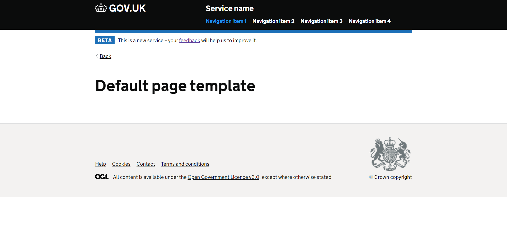

# About ukgov-ejs-starter
A starter project to quickly deploy websites that use the GOV.UK Design System.<br/>The project uses 
* Express
* GOV.UK Frontend
* Node Sass Middleware

Installed but not yet implemented: cookie-parser, morgan



## How to use
```bash
$ npm install
$ npm start
```

---

## GOV.UK Open Source
* [GDS Github Pages](https://alphagov.github.io/)
* [GOV.UK Platform as a Service](https://www.cloud.service.gov.uk/) - PaaS to host services, for public sector only.
* [alphagov/govuk-thegdsway](https://gds-way.cloudapps.digital/) - Docs site, "The GDS Way".
* [alphagov/govuk-docker](https://github.com/alphagov/govuk-docker) - As per the [GOV.UK Developer docs](https://docs.publishing.service.gov.uk/) it seems that this is what the government use for their apps. Ruby based.
* GOV.UK Frontend [Reference website](https://design-system.service.gov.uk/)